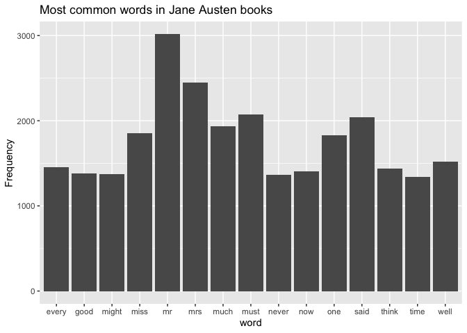

exercise1
================
Spencer Lee
2022-12-08

## Background

Using the janeaustenr package and Emma book, we will be counting the
number of words, and plotting the frequency of the most common words in
bar chart using ggplot2. We will also remove stop words using the
tidytext, stop_words() function.

``` r
# Using the Jane Austen book collection
# Create tibble and convert to one text per row
book <- austen_books() %>%
    group_by(book) %>%
    mutate(line = row_number()) %>%
    ungroup()
book
```

    ## # A tibble: 73,422 × 3
    ##    text                    book                 line
    ##    <chr>                   <fct>               <int>
    ##  1 "SENSE AND SENSIBILITY" Sense & Sensibility     1
    ##  2 ""                      Sense & Sensibility     2
    ##  3 "by Jane Austen"        Sense & Sensibility     3
    ##  4 ""                      Sense & Sensibility     4
    ##  5 "(1811)"                Sense & Sensibility     5
    ##  6 ""                      Sense & Sensibility     6
    ##  7 ""                      Sense & Sensibility     7
    ##  8 ""                      Sense & Sensibility     8
    ##  9 ""                      Sense & Sensibility     9
    ## 10 "CHAPTER 1"             Sense & Sensibility    10
    ## # … with 73,412 more rows

``` r
book_tidied <- book %>%
    unnest_tokens(word, text)
book_tidied
```

    ## # A tibble: 725,055 × 3
    ##    book                 line word       
    ##    <fct>               <int> <chr>      
    ##  1 Sense & Sensibility     1 sense      
    ##  2 Sense & Sensibility     1 and        
    ##  3 Sense & Sensibility     1 sensibility
    ##  4 Sense & Sensibility     3 by         
    ##  5 Sense & Sensibility     3 jane       
    ##  6 Sense & Sensibility     3 austen     
    ##  7 Sense & Sensibility     5 1811       
    ##  8 Sense & Sensibility    10 chapter    
    ##  9 Sense & Sensibility    10 1          
    ## 10 Sense & Sensibility    13 the        
    ## # … with 725,045 more rows

``` r
# Removing stopwords from book tibble
rmstop_book <- book_tidied %>%
    anti_join(get_stopwords())
```

    ## Joining, by = "word"

``` r
# Counting number of words in book
count_word <- rmstop_book %>%
    count(word, sort = T)
count_word
```

    ## # A tibble: 14,375 × 2
    ##    word      n
    ##    <chr> <int>
    ##  1 mr     3015
    ##  2 mrs    2446
    ##  3 must   2071
    ##  4 said   2041
    ##  5 much   1935
    ##  6 miss   1855
    ##  7 one    1831
    ##  8 well   1523
    ##  9 every  1456
    ## 10 think  1440
    ## # … with 14,365 more rows

``` r
# Bar chart of top 15 most common stop words
count_word_plot_t <- count_word[1:15, ]
count_word_plot_t
```

    ## # A tibble: 15 × 2
    ##    word      n
    ##    <chr> <int>
    ##  1 mr     3015
    ##  2 mrs    2446
    ##  3 must   2071
    ##  4 said   2041
    ##  5 much   1935
    ##  6 miss   1855
    ##  7 one    1831
    ##  8 well   1523
    ##  9 every  1456
    ## 10 think  1440
    ## 11 now    1405
    ## 12 good   1380
    ## 13 might  1369
    ## 14 never  1362
    ## 15 time   1337

``` r
# Plotting 15 most common words
plot_word <- ggplot(count_word_plot_t, aes(x = word, y = n)) +
    geom_col() +
    ylab("Frequency") +
    ggtitle("Most common words in Jane Austen books")
plot_word
```

<!-- -->

## Including Plots
