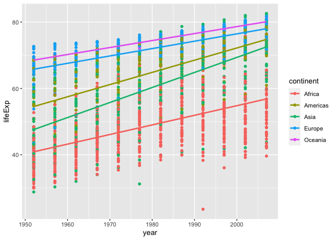

exercise3
================
Spencer Lee
2022-12-08

# Column of model objects

I will be performing data analysis on the gapminder dataset, where I’ll
be analyzing the relationship life expectancy and year. We will use the
linear. We will be extracting the 2 coefficients from each lm, where
each coefficient represents the slope and y-intercept of the model. This
can be fitted onto a plot and/or analyzed to determine the general trend
overtime. For example, we saw the USA have the coefficients of
1.841692e-01 and -2.910845e+02, which represent the slope and
y-intercept respectively. This demonstrates that the life expectancy in
the US is increasing overtime, and the y-intercept is -2.9 years.
Although the y-intercept is negative (at year 0), this part of the
linear model is out of range, where data in included from 1960 to 2005.

``` r
# Cleaning up gapinder
gap <- gapminder %>%
  as_tibble()

# Task 1 and Task 2
# Map each model to the gapminder data, we're using lifeExp and year in this case.
list_m <- gap %>%
  group_by(country) %>%
  nest() %>%
  mutate(model = map(data, ~ lm(lifeExp ~ year, data = .)))

# Task 3 intermediate table
list_m
```

    ## # A tibble: 142 × 3
    ## # Groups:   country [142]
    ##    country     data              model 
    ##    <fct>       <list>            <list>
    ##  1 Afghanistan <tibble [12 × 5]> <lm>  
    ##  2 Albania     <tibble [12 × 5]> <lm>  
    ##  3 Algeria     <tibble [12 × 5]> <lm>  
    ##  4 Angola      <tibble [12 × 5]> <lm>  
    ##  5 Argentina   <tibble [12 × 5]> <lm>  
    ##  6 Australia   <tibble [12 × 5]> <lm>  
    ##  7 Austria     <tibble [12 × 5]> <lm>  
    ##  8 Bahrain     <tibble [12 × 5]> <lm>  
    ##  9 Bangladesh  <tibble [12 × 5]> <lm>  
    ## 10 Belgium     <tibble [12 × 5]> <lm>  
    ## # … with 132 more rows

``` r
# Task 4
# Extracting coefficients from each lm and unnesting the calculations
list_m_pull <- list_m %>% 
    mutate(lm_coefficients = map(model, coef), 
           )
list_m_pull
```

    ## # A tibble: 142 × 4
    ## # Groups:   country [142]
    ##    country     data              model  lm_coefficients
    ##    <fct>       <list>            <list> <list>         
    ##  1 Afghanistan <tibble [12 × 5]> <lm>   <dbl [2]>      
    ##  2 Albania     <tibble [12 × 5]> <lm>   <dbl [2]>      
    ##  3 Algeria     <tibble [12 × 5]> <lm>   <dbl [2]>      
    ##  4 Angola      <tibble [12 × 5]> <lm>   <dbl [2]>      
    ##  5 Argentina   <tibble [12 × 5]> <lm>   <dbl [2]>      
    ##  6 Australia   <tibble [12 × 5]> <lm>   <dbl [2]>      
    ##  7 Austria     <tibble [12 × 5]> <lm>   <dbl [2]>      
    ##  8 Bahrain     <tibble [12 × 5]> <lm>   <dbl [2]>      
    ##  9 Bangladesh  <tibble [12 × 5]> <lm>   <dbl [2]>      
    ## 10 Belgium     <tibble [12 × 5]> <lm>   <dbl [2]>      
    ## # … with 132 more rows

``` r
list_un <- list_m_pull %>%
    unnest(lm_coefficients)
list_un
```

    ## # A tibble: 284 × 4
    ## # Groups:   country [142]
    ##    country     data              model  lm_coefficients
    ##    <fct>       <list>            <list>           <dbl>
    ##  1 Afghanistan <tibble [12 × 5]> <lm>          -508.   
    ##  2 Afghanistan <tibble [12 × 5]> <lm>             0.275
    ##  3 Albania     <tibble [12 × 5]> <lm>          -594.   
    ##  4 Albania     <tibble [12 × 5]> <lm>             0.335
    ##  5 Algeria     <tibble [12 × 5]> <lm>         -1068.   
    ##  6 Algeria     <tibble [12 × 5]> <lm>             0.569
    ##  7 Angola      <tibble [12 × 5]> <lm>          -377.   
    ##  8 Angola      <tibble [12 × 5]> <lm>             0.209
    ##  9 Argentina   <tibble [12 × 5]> <lm>          -390.   
    ## 10 Argentina   <tibble [12 × 5]> <lm>             0.232
    ## # … with 274 more rows

# Part 2: Plotting fitted lm on each country

Here we’re going to be fitting the lm model of each continent on a
scatter plot differentiated by different colours. We can see that
overtime, the general life expectancy in each continent is increasing at
the same rate. Interestingly Oceania has the highest life expectancy. We
can also see the the linear regression line fitted to each continents
life expectancy and year fall roughly between the scatter points at each
year, indicating the the linear model is fit correctly and appropriately
(linearity).

``` r
plot <- gapminder %>%
  group_by(continent, year) %>%
  ggplot(aes(x = year, y = lifeExp, color = continent)) +
  #  facet_wrap(c("Canada", "United Kingdom"), scales = "free") +
    geom_point() +
    geom_smooth(method = "lm", se = FALSE)
plot
```

    ## `geom_smooth()` using formula 'y ~ x'

<!-- -->
